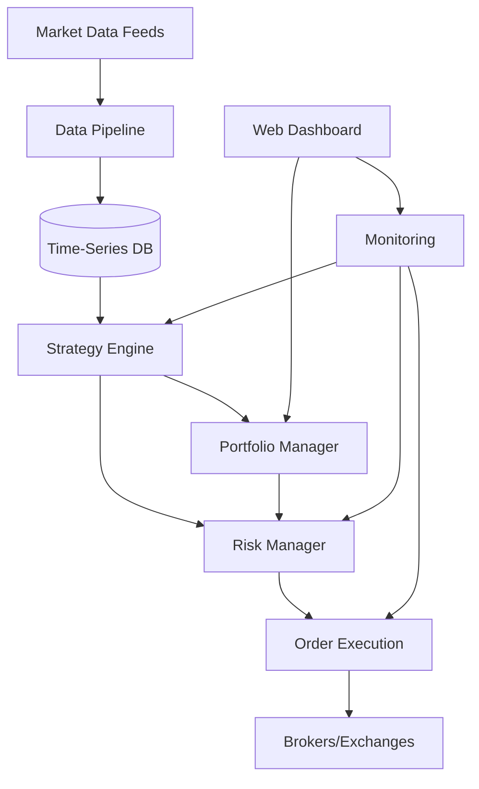

# System Architecture - Quantitative Trading Platform

## High-Level Architecture



## Core System Components

### 1. Data Layer

#### Data Pipeline (`src/data/`)
```python
class DataPipeline:
    """
    Centralized data ingestion and normalization.
    
    Responsibilities:
    - Connect to multiple data sources
    - Normalize timestamps to UTC
    - Handle corporate actions
    - Detect and fill gaps
    - Stream to strategies
    """
    
    async def start_feeds(self) -> None
    async def get_historical(self, symbol: str, start: datetime, end: datetime) -> pd.DataFrame
    async def subscribe_realtime(self, symbols: List[str], callback: Callable) -> None
```

#### Database Architecture
- **Primary**: ClickHouse for tick data (partitioned by date/symbol)
- **Cache**: Redis for real-time state
- **Reference**: PostgreSQL for metadata
- **Archive**: S3 for cold storage

#### Data Schema
```sql
-- ClickHouse tick data table
CREATE TABLE market_data (
    timestamp DateTime64(9),
    symbol String,
    bid Decimal(18, 8),
    ask Decimal(18, 8),
    last Decimal(18, 8),
    volume UInt64,
    exchange String,
    INDEX sym_time_idx (symbol, timestamp) TYPE minmax GRANULARITY 8192
) ENGINE = MergeTree()
PARTITION BY toYYYYMM(timestamp)
ORDER BY (symbol, timestamp);

-- PostgreSQL positions table  
CREATE TABLE positions (
    id UUID PRIMARY KEY,
    strategy_id VARCHAR(50),
    symbol VARCHAR(20),
    quantity DECIMAL(18, 8),
    entry_price DECIMAL(18, 8),
    entry_time TIMESTAMPTZ,
    exit_price DECIMAL(18, 8),
    exit_time TIMESTAMPTZ,
    pnl DECIMAL(18, 8),
    status VARCHAR(20)
);
```

### 2. Strategy Layer

#### Base Strategy Interface (`src/strategies/base.py`)
```python
@dataclass
class Signal:
    symbol: str
    direction: int  # 1 for long, -1 for short, 0 for flat
    target_position: float  # As fraction of portfolio
    confidence: float  # 0-1 score
    strategy_id: str
    timestamp: datetime
    metadata: Dict[str, Any]

class BaseStrategy(ABC):
    """All strategies must inherit from this class."""
    
    def __init__(self, strategy_id: str, config: StrategyConfig):
        self.strategy_id = strategy_id
        self.config = config
        self.risk_manager = RiskManager()
        self.logger = logging.getLogger(f"strategy.{strategy_id}")
        
    @abstractmethod
    async def generate_signals(self, data: MarketData) -> List[Signal]:
        """Generate trading signals from market data."""
        pass
    
    @abstractmethod
    async def calculate_position_size(self, signal: Signal, portfolio: Portfolio) -> float:
        """Calculate position size with risk management."""
        pass
        
    async def on_fill(self, execution: ExecutionReport) -> None:
        """Handle execution confirmations."""
        pass
        
    async def on_data(self, data: MarketData) -> None:
        """Handle incoming market data."""
        signals = await self.generate_signals(data)
        validated_signals = await self.risk_manager.validate_signals(signals)
        await self.submit_signals(validated_signals)
```

#### Strategy Registry Pattern
```python
class StrategyRegistry:
    """Manages all active strategies."""
    
    _strategies: Dict[str, BaseStrategy] = {}
    
    @classmethod
    def register(cls, strategy_id: str, strategy: BaseStrategy) -> None:
        cls._strategies[strategy_id] = strategy
        
    @classmethod
    def get_all_active(cls) -> List[BaseStrategy]:
        return [s for s in cls._strategies.values() if s.is_active]
```

### 3. Risk Management Layer

#### Risk Manager (`src/risk/manager.py`)
```python
class RiskManager:
    """
    Centralized risk management across all strategies.
    
    Enforces:
    - Position limits (2% max per position)
    - Portfolio limits (20% max drawdown)
    - Correlation limits (0.7 max between strategies)
    - VaR limits (2.5% daily)
    """
    
    async def validate_signals(self, signals: List[Signal]) -> List[Signal]:
        """Filter signals that violate risk limits."""
        validated = []
        for signal in signals:
            if await self.check_position_limit(signal):
                if await self.check_portfolio_impact(signal):
                    if await self.check_correlation(signal):
                        validated.append(signal)
        return validated
    
    async def calculate_portfolio_var(self) -> float:
        """Calculate current portfolio Value at Risk."""
        pass
    
    async def trigger_emergency_liquidation(self) -> None:
        """Emergency risk reduction."""
        pass
```

#### Risk Metrics Pipeline
```python
class RiskMetrics:
    """Real-time risk calculations."""
    
    async def calculate_sharpe_ratio(window_days: int = 252) -> float
    async def calculate_max_drawdown() -> float
    async def calculate_correlation_matrix() -> pd.DataFrame
    async def calculate_var(confidence: float = 0.95) -> float
    async def calculate_expected_shortfall(confidence: float = 0.95) -> float
```

### 4. Execution Layer

#### Order Management System (`src/execution/oms.py`)
```python
@dataclass
class Order:
    id: str
    symbol: str
    side: OrderSide  # BUY/SELL
    quantity: float
    order_type: OrderType  # MARKET/LIMIT/STOP
    limit_price: Optional[float]
    time_in_force: TimeInForce  # DAY/GTC/IOC/FOK
    strategy_id: str
    created_at: datetime

class OrderManager:
    """Manages order lifecycle and routing."""
    
    async def submit_order(self, order: Order) -> ExecutionReport:
        """Submit order to execution engine."""
        # Pre-trade compliance checks
        await self.compliance_check(order)
        
        # Smart order routing
        venue = await self.select_venue(order)
        
        # Execute with retry logic
        report = await self.execute_with_retry(order, venue)
        
        # Post-trade processing
        await self.update_positions(report)
        await self.calculate_tca(report)
        
        return report
```

#### Execution Algorithms (`src/execution/algos/`)
```python
class VWAPAlgo:
    """Volume-Weighted Average Price execution."""
    
    async def execute(self, parent_order: Order) -> List[ExecutionReport]:
        """Slice parent order into child orders following volume curve."""
        volume_curve = await self.get_historical_volume_curve(parent_order.symbol)
        child_orders = self.slice_order(parent_order, volume_curve)
        
        reports = []
        for child in child_orders:
            report = await self.submit_child_order(child)
            reports.append(report)
            
        return reports
```

### 5. Portfolio Management

#### Portfolio Manager (`src/portfolio/manager.py`)
```python
class PortfolioManager:
    """
    Manages overall portfolio state and optimization.
    
    Responsibilities:
    - Track positions across strategies
    - Optimize allocation
    - Rebalance portfolio
    - Calculate performance metrics
    """
    
    async def get_current_positions(self) -> Dict[str, Position]:
    async def calculate_optimal_allocation(self) -> Dict[str, float]:
    async def rebalance(self) -> List[Order]:
    async def calculate_attribution(self) -> Attribution:
```

### 6. Infrastructure Layer

#### Event Bus (`src/infrastructure/events.py`)
```python
class EventBus:
    """
    Async event-driven communication between components.
    
    Events:
    - MarketDataEvent
    - SignalEvent
    - OrderEvent
    - FillEvent
    - RiskEvent
    """
    
    def __init__(self):
        self._handlers: Dict[Type[Event], List[Callable]] = defaultdict(list)
        
    def subscribe(self, event_type: Type[Event], handler: Callable) -> None:
        self._handlers[event_type].append(handler)
        
    async def publish(self, event: Event) -> None:
        for handler in self._handlers[type(event)]:
            asyncio.create_task(handler(event))
```

#### Service Orchestrator (`src/infrastructure/orchestrator.py`)
```python
class TradingSystemOrchestrator:
    """
    Main orchestrator that coordinates all components.
    """
    
    def __init__(self):
        self.data_pipeline = DataPipeline()
        self.strategy_engine = StrategyEngine()
        self.risk_manager = RiskManager()
        self.order_manager = OrderManager()
        self.portfolio_manager = PortfolioManager()
        self.event_bus = EventBus()
        
    async def start(self) -> None:
        """Start all system components in correct order."""
        await self.data_pipeline.initialize()
        await self.risk_manager.initialize()
        await self.strategy_engine.load_strategies()
        await self.order_manager.connect_brokers()
        await self.start_event_loop()
        
    async def shutdown(self) -> None:
        """Graceful shutdown of all components."""
        await self.strategy_engine.close_all_positions()
        await self.order_manager.cancel_all_orders()
        await self.data_pipeline.disconnect()
```

## Service Communication

### Internal APIs

All internal services communicate via async REST APIs or gRPC:

```python
# REST API Example (FastAPI)
@app.post("/api/v1/signals")
async def submit_signal(signal: Signal) -> Response:
    """Submit signal from strategy to execution engine."""
    validated = await risk_manager.validate_signal(signal)
    if validated:
        order = await portfolio_manager.create_order(validated)
        result = await order_manager.submit_order(order)
        return {"status": "accepted", "order_id": result.order_id}
    return {"status": "rejected", "reason": "risk_limits"}
```

### Message Queue Integration

For high-throughput async processing:

```python
# Redis Streams for event streaming
async def publish_market_data(data: MarketData):
    await redis.xadd(
        'market_data_stream',
        {'symbol': data.symbol, 'price': data.price, 'volume': data.volume}
    )

async def consume_market_data():
    async for message in redis_stream.read('market_data_stream'):
        await process_market_data(message)
```

## Deployment Architecture

### Container Structure

```yaml
# docker-compose.yml
version: '3.8'
services:
  strategy_engine:
    build: ./services/strategy_engine
    environment:
      - RISK_LIMITS=production
    depends_on:
      - clickhouse
      - redis
      
  risk_manager:
    build: ./services/risk_manager
    ports:
      - "8001:8000"
      
  order_executor:
    build: ./services/order_executor
    environment:
      - BROKER_ENV=production
      
  clickhouse:
    image: clickhouse/clickhouse-server:latest
    volumes:
      - clickhouse_data:/var/lib/clickhouse
      
  redis:
    image: redis:alpine
    command: redis-server --appendonly yes
    
  monitoring:
    build: ./services/monitoring
    ports:
      - "3000:3000"  # Grafana
      - "9090:9090"  # Prometheus
```

### Kubernetes Architecture (Production)

```yaml
# k8s/deployment.yaml
apiVersion: apps/v1
kind: Deployment
metadata:
  name: strategy-engine
spec:
  replicas: 3
  strategy:
    type: RollingUpdate
  template:
    spec:
      containers:
      - name: strategy-engine
        image: quant-system/strategy-engine:latest
        resources:
          requests:
            memory: "2Gi"
            cpu: "1"
          limits:
            memory: "4Gi"
            cpu: "2"
```

## Monitoring & Observability

### Metrics Collection

```python
# Prometheus metrics
from prometheus_client import Counter, Histogram, Gauge

signals_generated = Counter('signals_generated_total', 'Total signals generated')
order_latency = Histogram('order_latency_seconds', 'Order execution latency')
portfolio_value = Gauge('portfolio_value_usd', 'Current portfolio value')

# Usage
signals_generated.labels(strategy='momentum').inc()
with order_latency.time():
    await execute_order(order)
portfolio_value.set(current_value)
```

### Logging Architecture

```python
# Structured logging with correlation IDs
logger = structlog.get_logger()

async def process_signal(signal: Signal, correlation_id: str):
    log = logger.bind(
        correlation_id=correlation_id,
        strategy=signal.strategy_id,
        symbol=signal.symbol
    )
    
    log.info("Processing signal", confidence=signal.confidence)
    
    try:
        order = await create_order(signal)
        log.info("Order created", order_id=order.id)
    except Exception as e:
        log.error("Order creation failed", error=str(e))
        raise
```

## Security Architecture

### API Security

```python
# JWT authentication for APIs
from fastapi_jwt_auth import AuthJWT

@app.post("/api/v1/orders")
async def submit_order(order: Order, Authorize: AuthJWT = Depends()):
    Authorize.jwt_required()
    current_user = Authorize.get_jwt_subject()
    
    # Role-based access control
    if not has_permission(current_user, "submit_orders"):
        raise HTTPException(status_code=403, detail="Insufficient permissions")
        
    return await order_manager.submit_order(order)
```

### Secrets Management

```python
# Using AWS Secrets Manager
import boto3

class SecretsManager:
    def __init__(self):
        self.client = boto3.client('secretsmanager')
        
    def get_api_key(self, exchange: str) -> str:
        secret = self.client.get_secret_value(
            SecretId=f"quant-system/{exchange}/api-key"
        )
        return json.loads(secret['SecretString'])['api_key']
```

## Disaster Recovery

### Backup Strategy

- **Real-time replication**: ClickHouse to backup region
- **Point-in-time recovery**: PostgreSQL with WAL archiving
- **State snapshots**: Redis persistence every 5 minutes
- **S3 archival**: Daily backups with 30-day retention

### Failover Procedures

```python
class FailoverManager:
    async def detect_primary_failure(self) -> bool:
        """Health check primary systems."""
        pass
        
    async def promote_secondary(self) -> None:
        """Promote secondary to primary."""
        # 1. Stop writes to primary
        # 2. Ensure replication caught up
        # 3. Update DNS/load balancer
        # 4. Start secondary as primary
        pass
```

## Performance Considerations

### Optimization Targets

- **Market data ingestion**: < 10ms latency
- **Signal generation**: < 50ms per strategy
- **Order submission**: < 100ms end-to-end
- **Risk calculations**: < 20ms for position checks
- **Database queries**: < 5ms for recent data

### Caching Strategy

```python
# Multi-level caching
class CacheManager:
    def __init__(self):
        self.l1_cache = {}  # In-memory (5 seconds)
        self.l2_cache = Redis()  # Redis (60 seconds)
        self.l3_cache = ClickHouse()  # Database
        
    async def get(self, key: str) -> Any:
        # Try L1
        if key in self.l1_cache:
            return self.l1_cache[key]
            
        # Try L2
        value = await self.l2_cache.get(key)
        if value:
            self.l1_cache[key] = value
            return value
            
        # Hit L3
        value = await self.l3_cache.query(key)
        await self.l2_cache.set(key, value, expire=60)
        self.l1_cache[key] = value
        return value
```

---

## Decision Log
- 2024-01-15: Chose ClickHouse over TimescaleDB for better compression
- 2024-01-20: Implemented VWAP instead of TWAP for better fills

*This architecture ensures scalability, reliability, and maintainability while supporting the complex requirements of institutional-grade quantitative trading.*