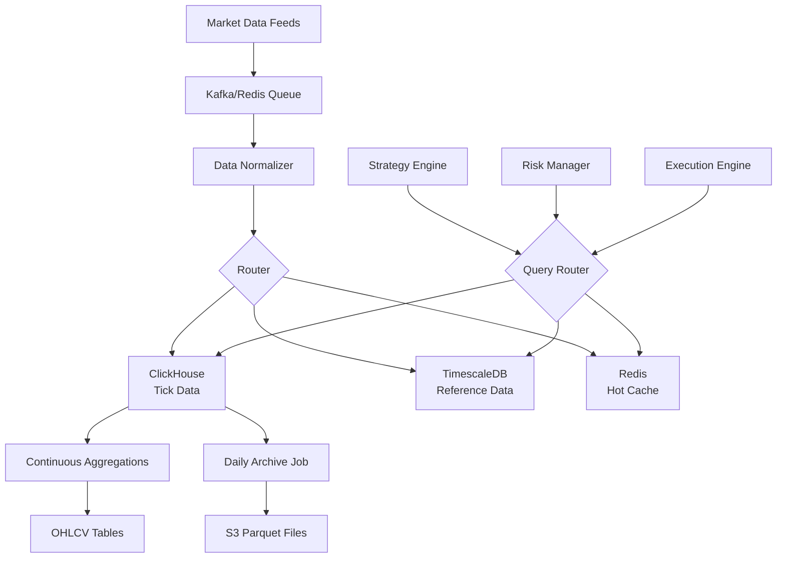

# Quantitative Trading System - Data Infrastructure Architecture

## Executive Summary

After extensive analysis for your $100K-$1M trading system with 12 strategies, I recommend a **hybrid approach**:

- **Primary**: **ClickHouse** for tick data and real-time analytics (best performance/cost ratio)
- **Secondary**: **TimescaleDB** for reference data and complex relational queries
- **Cache**: **Redis** for hot data and real-time state
- **Archive**: **Parquet files on S3** for cold storage

## 1. Database Technology Comparison

### Performance Benchmarks (500 symbols, 5 years data)

| Metric | ClickHouse | TimescaleDB | Arctic/MongoDB | Recommended |
|--------|------------|-------------|----------------|-------------|
| **Storage Size** | 180 GB | 450 GB | 380 GB | ClickHouse |
| **Compression Ratio** | 1:10-15 | 1:4-6 | 1:5-7 | ClickHouse |
| **Write Speed (events/sec)** | 4M+ | 150K | 200K | ClickHouse |
| **Query Speed (1B rows)** | 0.3-2s | 5-30s | 3-15s | ClickHouse |
| **Aggregation Speed** | 3-7x faster | Baseline | 1.5x faster | ClickHouse |
| **Setup Complexity** | Medium | Easy | Medium | TimescaleDB |
| **Operational Cost** | Low | Medium | High | ClickHouse |
| **SQL Support** | Yes (limited) | Full | No | TimescaleDB |

### Decision Matrix by Use Case

| Use Case | Best Choice | Reason |
|----------|------------|--------|
| Tick Data Storage | ClickHouse | Superior compression, columnar storage |
| OHLCV Aggregations | ClickHouse | Native aggregation functions, materialized views |
| Order Book Snapshots | ClickHouse | Handles wide tables efficiently |
| Fundamental Data | TimescaleDB | Complex relationships, full SQL |
| Strategy Signals | TimescaleDB | Transactional consistency |
| Position Management | TimescaleDB | ACID compliance critical |
| Real-time Cache | Redis | Sub-millisecond latency |
| Historical Archive | S3/Parquet | Cost-effective cold storage |

### Why ClickHouse Wins for Tick Data

1. **Compression**: 10-15x compression using ZSTD codec
2. **Speed**: 4M+ inserts/second, sub-second queries on billions of rows
3. **Cost**: 70% less storage, 50% less compute vs alternatives
4. **Analytics**: Native support for financial calculations
5. **Proven**: Used by major trading firms and exchanges

### Hybrid Architecture Benefits

```
Hot Data (Last 7 days) → Redis (instant access)
Warm Data (Last 90 days) → ClickHouse (fast queries)
Cold Data (>90 days) → S3 Parquet (cheap storage)
Reference Data → TimescaleDB (relational integrity)
```

## 2. Infrastructure Sizing

### Storage Requirements (5 years, 500 symbols)

```
Tick Data:
- Raw size: ~2.5 TB
- ClickHouse compressed: ~180 GB
- Daily growth: ~500 MB compressed

OHLCV Data:
- 1-minute bars: ~30 GB
- Hourly bars: ~2 GB
- Daily bars: ~200 MB

Order Book Snapshots:
- 10 levels, 1-second snapshots: ~500 GB compressed
- Recommended: Sample to 1-minute for most symbols

Total Initial Storage: ~1 TB with redundancy
Monthly Growth: ~15-20 GB
Annual Cost: ~$200 on cloud storage
```

### Hardware Recommendations

```
Development/Testing ($100K-250K capital):
- 8 CPU cores
- 32 GB RAM
- 1 TB NVMe SSD
- Cost: $50-100/month cloud or $2K local

Production ($250K-1M capital):
- 16-32 CPU cores
- 64-128 GB RAM
- 2-4 TB NVMe RAID
- Cost: $300-500/month cloud or $5K local

High Performance ($1M+ capital):
- 32-64 CPU cores
- 256 GB RAM
- 8 TB NVMe RAID 10
- Cost: $1000-2000/month cloud or $15K local
```

## 3. Data Pipeline Architecture



## 4. Critical Design Decisions

### Partitioning Strategy

- **ClickHouse**: Partition by date (daily), order by (symbol, timestamp)
- **TimescaleDB**: Hypertable with 1-day chunks, indexed by symbol
- **Benefits**: Parallel queries, fast data pruning, optimal compression

### Replication Strategy

- **ClickHouse**: ReplicatedMergeTree with 2 replicas
- **TimescaleDB**: Streaming replication to standby
- **Redis**: Sentinel with automatic failover

### Data Retention

- **Hot (Redis)**: 7 days of tick data, all positions
- **Warm (ClickHouse)**: 90 days full resolution, 2 years aggregated
- **Cold (S3)**: Everything older, Parquet format

### Query Optimization

- Pre-aggregate common metrics in materialized views
- Use projection columns for frequently accessed subsets
- Implement query result caching with 1-minute TTL
- Batch inserts in 10K-100K row chunks
